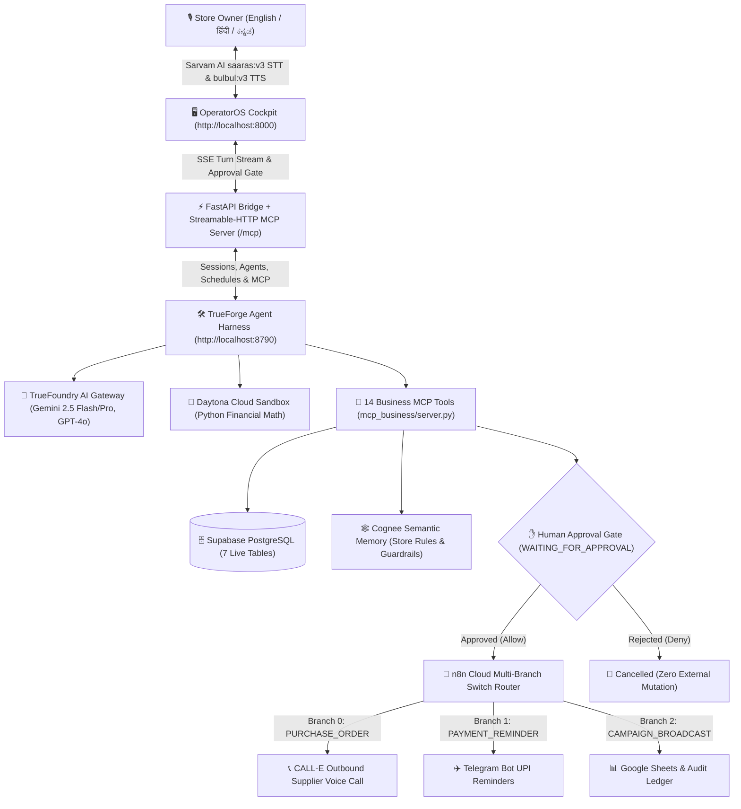

# OperatorOS — Multilingual Voice-First Autonomous AI Business Operator
### Built for **EmberGround AI Hackathon 2026 | Bangalore** (*BUILD. BREAK. SHIP.*) — **Track 2: AI Business Operator**

[](https://github.com/sufiyan-cyber/emberground_hackathon)
[](https://github.com/sufiyan-cyber/emberground_hackathon)
[](http://localhost:8790)
[](https://truefoundry.com)
[](http://localhost:8000/mcp)
[](https://daytona.io)
[](https://supabase.com)
[-orange.svg)](https://sarvam.ai)
[](LICENSE)

---

## 📋 1. Executive Summary & Track 2 Solution Overview (`AI Business Operator`)

### The Problem
Indian retail and kirana store owners spend hours every day manually executing repetitive operational workflows: reconciling cash drawers at closing time, checking depleted perishable stock before supplier cutoffs, chasing overdue customer credit (*Khata*), and running customer retention promotions across fragmented tools—while facing language barriers with English-only software.

### What the Autonomous AI Business Operator Reaches
**OperatorOS** is a voice-first autonomous store manager that reaches **6 real external systems** through a Streamable-HTTP **Model Context Protocol (MCP)** server (`http://localhost:8000/mcp`) exposing **14 typed business tools**:
1. **Supabase PostgreSQL** (`businesses`, `sales`, `inventory`, `customers`, `purchase_orders`, `actions`, `audit_events`) for live transactional reads and writes.
2. **Cognee Semantic Memory** for store operating policies (minimum cash float, supplier cutoff hours, credit collection thresholds).
3. **Daytona Cloud Sandbox** for isolated Python execution of financial reconciliation, reorder math, and campaign ROI simulations.
4. **n8n Cloud Multi-Branch Webhook Router** (`PURCHASE_ORDER`, `PAYMENT_REMINDER`, `CAMPAIGN_BROADCAST`).
5. **CALL-E Voice API (`api.heycall-e.com`)** & **Telegram Bot API** to place real outbound supplier phone calls and send customer UPI payment reminders.
6. **Google Sheets & Local CSV Ledger** + **Sarvam AI (`saaras:v3`, `bulbul:v3`, `mayura:v1`)** for real-time English (`en-IN`), Hindi (`hi-IN`), and Kannada (`kn-IN`) voice-to-voice interaction.

### Where It Stops (Human-in-the-Loop Approval Gate & Financial Guardrails)
OperatorOS **never** executes consequential mutations (spending store money, calling suppliers, or messaging customers) without authorization. It enforces a **two-phase Prepare $\rightarrow$ Approve $\rightarrow$ Execute lock**:
- Read and `prepare_*` MCP tools stage a `PENDING_APPROVAL` record in Supabase after verifying hard financial guardrails (**₹5,000 minimum cash drawer float** and **$\ge 7$ days / $\ge \text{₹}500$ overdue credit rule**).
- The turn halts at `tool.approval_required` (`WAITING_FOR_APPROVAL`) until the merchant explicitly approves or denies via voice (*"Approve" / "Haan" / "Haudu"*) or UI click.

### Multi-Agent Architecture & TrueForge Orchestration
**TrueForge (`http://localhost:8790`)** serves as the multi-agent runtime and control plane:
- **Model Provider (`truefoundry`):** Routes across `truefoundry/gemini-2-5-flash`, `truefoundry/gemini-2-5-pro`, and `truefoundry/gpt-4o`.
- **MCP Server (`operator-os-business-mcp`):** Connects TrueForge directly to our 14 business tools at `/mcp`.
- **Sandbox Provider (`daytona`):** Executes generated Python math in isolated containers.
- **4 Specialized Agents & 3 Autonomous Cron Schedules:** `operator-os-chief-of-staff`, `kirana-procurement-caller` (`0 8 * * *`), `khata-recovery-campaign-agent` (`0 18 * * *` & `0 10 * * 0`), and `daytona-margin-analyst`, with live session mirroring into TrueForge `/api/v1/sessions`.

### What Is Real vs. Simulated
- **100% Real:** Supabase PostgreSQL reads/writes, TrueForge agent/MCP/schedule/session provisioning, Daytona Python code execution, Sarvam AI Hindi/Kannada/English STT/TTS/translation, n8n Cloud webhook execution, CALL-E outbound supplier phone calls, Telegram bot messages, and Google Sheets row logging.
- **Simulated/Demo Seeded:** Initial store catalog (*Green Valley Organic Grocers, Indiranagar, Bangalore*) and customer UPI payment links (`upi://pay?...`) inside reminder messages so no real bank money is debited during live demos.

### Known Limits & Resilience
1. Outbound CALL-E supplier phone calls require valid E.164 phone numbers and active CALL-E call credits (a manual **Initiate Call** button is also available on the dashboard for instant demo verification).
2. Free-tier cloud webhooks (n8n Cloud / Sarvam API) can experience cold-start latency or quota limits, which OperatorOS mitigates via automatic zero-downtime failovers (Gemini Audio STT, Google Neural GTX translation, Microsoft Edge Neural TTS, and local SQLite/subprocess fallbacks).

---

## 🏗️ 2. System Architecture



---

## 🤖 3. The 4 Specialized Agents in TrueForge (`http://localhost:8790`)

| Agent Name | Model (`truefoundry` Provider) | Role & Responsibilities | Autonomous Schedule |
|:---|:---|:---|:---|
| **`operator-os-chief-of-staff`** | `truefoundry/gemini-2-5-flash` | Primary multilingual orchestrator; handles daily store closing, POS sales audits, and human approval checkpoints. | On-Demand (Voice & Chat) |
| **`kirana-procurement-caller`** | `truefoundry/gpt-4o` | Monitors low-stock perishables, compares supplier MOQs/cutoffs, stages Purchase Orders, and triggers CALL-E voice calls. | `0 8 * * *` (`morning-low-stock-reorder-audit`) |
| **`khata-recovery-campaign-agent`** | `truefoundry/gemini-2-5-flash` | Audits overdue customer credit accounts ($\ge 7$ days, $\ge \text{₹}500$) and runs festive retention broadcasts via Telegram. | `0 18 * * *` (`evening-khata-payment-reminders`) & `0 10 * * 0` (`weekly-festive-retention-campaign`) |
| **`daytona-margin-analyst`** | `truefoundry/gemini-2-5-pro` | Writes and runs deterministic Python scripts inside Daytona Sandbox for cash reconciliation and margin forecasting. | Invoked via Tool / Subagent |

---

## 🔌 4. The 14 Model Context Protocol (MCP) Tools (`/mcp`)

Our FastAPI server exposes a standards-compliant **Streamable-HTTP MCP Server** at `http://localhost:8000/mcp` (implemented in [`mcp_business/server.py`](mcp_business/server.py)):

### A. Live Database & Semantic Memory Read Tools (Safe)
1. `get_business_profile` — Fetches store metadata, opening float (`₹5,000`), and live `current_cash_in_drawer` from Supabase.
2. `get_sales_data` — Aggregates live daily POS transactions across Cash, UPI, and Card from the `sales` table.
3. `get_inventory` — Queries live SKU stock counts and flags items where `current_stock <= reorder_level`.
4. `get_customer_dues` — Queries the `customers` table for overdue credit (*Khata*) accounts past the 7-day threshold.
5. `get_supplier_information` — Retrieves supplier contact numbers, lead times, and cutoff windows.
6. `search_business_memory` — Queries **Cognee Semantic Memory** for store operating policies and historical conversion rules.

### B. Isolated Sandbox Execution Tool
7. `run_analysis_in_sandbox` — Executes generated Python code inside **Daytona Cloud Sandbox** (with automatic local isolated subprocess fallback) to compute cash variance, safe drop amounts, PO totals, and campaign ROI.

### C. Stage 1 "Prepare" Tools (Creates `PENDING_APPROVAL` Lock in Supabase)
8. `prepare_purchase_order` — Validates order quantities against supplier MOQs and cash reserve guardrails, saving a `PENDING_APPROVAL` action record.
9. `prepare_customer_dues_reminder` — Drafts polite UPI payment reminders for eligible overdue customers (`PENDING_APPROVAL`).
10. `prepare_campaign` — Stages a promotional broadcast with projected ROI metrics (`PENDING_APPROVAL`).

### D. Stage 2 "Execute" & Verification Tools (Unlocked Only After Human Approval)
11. `create_purchase_order` — Transitions the PO action to `EXECUTED`, triggers **n8n Branch 0**, places an outbound supplier voice call via **CALL-E**, sends a **Telegram** alert, and appends to **Google Sheets**.
12. `send_customer_messages` — Transitions the reminder action to `EXECUTED`, triggers **n8n Branch 1**, dispatches **Telegram** payment reminders, and logs to **Google Sheets**.
13. `broadcast_campaign` — Transitions the campaign action to `EXECUTED`, triggers **n8n Branch 2**, broadcasts the offer via **Telegram**, and logs to **Google Sheets**.
14. `get_action_status` — Performs readback verification on any `action_id` in Supabase PostgreSQL.

---

## 🚀 5. Setup Steps & Quick Start (Run in 2 Minutes)

### Prerequisites
- **Python 3.10+** (tested with Python 3.13)
- **Node.js 20+** (for running the TrueForge local harness)
- **FFmpeg** (optional, automatically used for microphone audio normalization if installed)

### Step 1: Clone the Repository & Install Python Dependencies
```bash
git clone https://github.com/sufiyan-cyber/emberground_hackathon.git
cd emberground_hackathon
pip install -r requirements.txt
```

### Step 2: Configure Environment Variables
Copy `.env.example` to `.env` and fill in your API keys (OperatorOS also includes automatic local SQLite, subprocess sandbox, and Edge-Neural TTS fallbacks so it runs out of the box):
```bash
cp .env.example .env
```

### Step 3: Seed the Database (Supabase PostgreSQL or Local SQLite)
```bash
python -m db.seed
```

### Step 4: Start the TrueForge Agent Harness (`http://localhost:8790`)
In Terminal 1:
```bash
npx @truefoundry/trueforge@latest
```
Once running, open **[http://localhost:8790](http://localhost:8790)** to inspect the 4 provisioned agents, MCP server connection (`operator-os-business-mcp`), Daytona sandbox provider, and active cron schedules.

### Step 5: Start the OperatorOS Backend & Cockpit (`http://localhost:8000`)
In Terminal 2:
```bash
python -m uvicorn apps.api.main:app --port 8000
```
Open **[http://127.0.0.1:8000](http://127.0.0.1:8000)** in Chrome or Edge:
1. **Speak in English, Hindi (`हिंदी`), or Kannada (`ಕನ್ನಡ`)** (or click any of the 1-Click Store Workflows or the **`📞 Initiate Call`** button).
2. Watch TrueForge call live MCP tools, execute generated Python code in the Daytona Sandbox, and pause at the **Human Approval Checkpoint**.
3. Say **"Approve"** (or **"हाँ"** / **"ಹೌದು"**) or click **Approve & Execute** to watch **n8n**, **CALL-E**, **Telegram**, **Google Sheets**, and **Supabase** update in real time!

### Step 6: Run Automated End-to-End Verification Suite
```bash
python -m tests.test_flow
```

---

## 📁 6. Repository Structure

```text
emberground_hackathon/
├── apps/
│   ├── api/
│   │   └── main.py          # FastAPI server, /mcp Streamable-HTTP server, Sarvam v3 voice & TTS failover
│   └── web/
│       └── index.html       # OperatorOS Cockpit UI, Initiate Call trigger, Live Voice HUD & Ledger tabs
├── agent/
│   └── business_operator.py # TrueForge agent session engine, semantic router, Daytona scripts & approval gate
├── mcp_business/
│   └── server.py            # All 14 typed Business MCP tools & financial guardrails
├── business_memory/
│   └── memory_store.py      # Cognee Semantic Memory adapter + local policy store
├── sandbox/
│   └── sandbox_runner.py    # Daytona Cloud Sandbox SDK runner + isolated local Python fallback
├── db/
│   ├── database.py          # SQLAlchemy engine (Supabase PostgreSQL primary + SQLite fallback)
│   ├── models.py            # 7 PostgreSQL tables: businesses, products, inventory, sales, customers, actions, audit_events
│   └── seed.py              # Retail grocery dataset seeder
├── n8n/
│   ├── executor.py          # Multi-branch n8n webhook dispatcher + direct CALL-E, Telegram & CSV/Sheets sync
│   └── workflows/
│       └── operator_os_n8n_cloud_import.json  # Ready-to-import n8n Cloud multi-branch workflow JSON
├── tests/
│   └── test_flow.py         # End-to-end automated verification suite
├── .env.example             # Clean environment template (zero secrets committed)
├── LICENSE                  # MIT Open Source License
├── requirements.txt         # Python dependencies
└── README.md                # Solution writeup, architecture & setup documentation
```

---

## 📄 License
Released under the **[MIT License](LICENSE)**.
